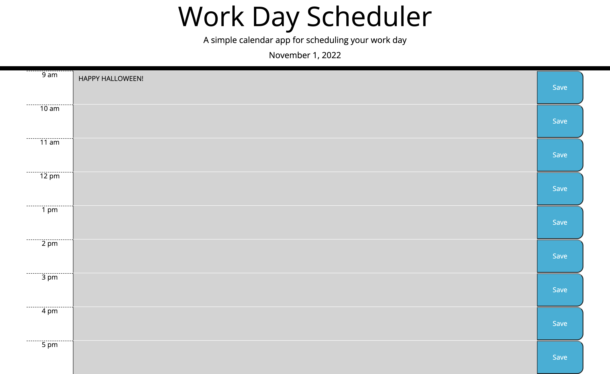

# calendar-app

## Description

The objective of this repository is to create a function workday planner. With hours from 9 am to 5 pm, a user should be able to input their tasks and objectives into each time slot, while being able to identify the current time visually. 

Unlike previous assignment, you are required to incorporate APIs such as JQuery, moment.js, and Bootstrap to assist in building your code. 

No installation required. 

## User Story

```md
* **AS AN** employee with a busy schedule
* **I WANT** to add important events to a daily planner
* **SO THAT** I can manage my time effectively
```

## Acceptance Criteria

```md
* **GIVEN** I am using a daily planner to create a schedule
* **WHEN** I open the planner
* **THEN** the current day is displayed at the top of the calendar
* **WHEN** I scroll down
* **THEN** I am presented with timeblocks for standard business hours
* **WHEN** I view the timeblocks for that day
* **THEN** each timeblock is color coded to indicate whether it is in the past, present, or future
* **WHEN** I click into a timeblock
* **THEN** I can enter an event
* **WHEN** I click the save button for that timeblock
* **THEN** the text for that event is saved in local storage
* **WHEN** I refresh the page
* **THEN** the saved events persist

## Project Completion

The HTML and the CSS are mostly done for you. However, you do need to add the rows for each time slot into the HTML (there are ways of doing this solely through JS, but I was unable to figure it out myself). Each row has a time Id, a class, and the internal elements of div, textarea, and button. After that, you move to JS for everything else!

First, I include an onload function to load the date in the header. 

Next, I create a function that embodies everything of the container. I start with creating a variable and a forloop to retrieve items from the local storage. 

Next, I create an event on click of the saveBtn to save new information into the local storge. 


The last major section is organizing the time. It was a significant challenge, but it was doable. I create the necessary variables to use in the if loop for color organization.

Eventually, I used a large if loop to add and remove classes for the colors. I feel there is a cleaner way of approaching this, but I do not know of what it is yet. However, this is an effective method for the assignment. 

## Screenshot



## Link

The deployed application can be accessed here: https://cbazil114.github.io/calendar-app/


## Credits

* i want to thank Natasha Mann for tutoring me again, and I would like to thank the many learning assistants who helped me along the way!